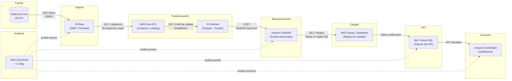

# PRUEBA TÉCNICA – ANALISTA SENIOR DE GOBIERNO DE DATOS
## HDI Seguros Colombia | Gerencia de Datos y Analítica
### Sección B: Gobierno de Datos, Normativas y Trazabilidad

---

## B1. Ficha del KPI: "% Siniestros pagados en ≤ 1 día"

### Definiciones previas

| Término | Definición |
|---|---|
| **Siniestro** | Materialización del riesgo cubierto por una póliza que genera un reclamo del asegurado a la compañía. |
| **FNOL (First Notice of Loss)** | Primer aviso de siniestro. Fecha en que el asegurado o sus beneficiarios reportan el evento a HDI Seguros. Es el punto de partida del SLA. |
| **SLA 1 día** | Acuerdo de Nivel de Servicio que establece que el pago del siniestro debe realizarse dentro de 1 día calendario desde la recepción del FNOL. |

### Ficha técnica del KPI

| Elemento | Descripción |
|---|---|
| **Objetivo** | Medir la eficiencia operativa en el pago de siniestros dentro del SLA establecido |
| **Definición** | Porcentaje de siniestros pagados cuya diferencia entre fecha de FNOL y fecha de pago es ≤ 1 día |
| **Fórmula** | (Siniestros pagados en ≤ 1 día ÷ Total de siniestros pagados en el período) × 100 |
| **Fuente autorizada** | Amazon Redshift (plataforma analítica objetivo) |
| **Granularidad** | Mensual, segmentable por canal y producto |
| **Owner** | Dirección de Siniestros |
| **Steward** | Analista de Gobierno de Datos — Dominio Siniestros |
| **Supuesto crítico #1** | La calidad del registro de `fecha_fnol` y `fecha_pago` es fundamental: fechas nulas o incorrectas distorsionan el KPI. Si un siniestro tiene `fecha_pago` nula, no puede incluirse en el cálculo, subestimando el denominador. |
| **Supuesto crítico #2** | La definición de "pagado" asume `estado_siniestro = 'Pagado'` con `fecha_pago` no nula. Siniestros con pagos parciales progresivos sin cierre formal podrían no reflejarse adecuadamente si el estado no se actualiza hasta el pago total. |

---

## B2. Protección de datos y clasificación

### Campos con datos personales o sensibles

| Campo | Clasificación | Fundamento |
|---|---|---|
| `id_cliente` | Dato personal (indirecto) | Identificador único que permite asociar información a una persona natural |
| `tipo_doc` | Dato personal | Describe el tipo de documento de identidad (CC, CE, NIT, etc.) |
| `nro_doc_hash` | Dato personal seudonimizado | Aunque es hash SHA-256, sigue siendo un identificador susceptible de re-identificación por fuerza bruta; debe tratarse como PII seudonimizada |
| `ciudad` | Dato personal (indirecto) | Ubicación geográfica que en combinación con otros datos puede identificar a una persona |
| `segmento` | Dato sensible (comercial) | Clasificación comercial interna que refleja perfilamiento del cliente |
| `banco` | Dato personal financiero | Entidad bancaria del asegurado; dato sensible según normativa financiera |

### Normativa colombiana aplicable

| Norma | Alcance |
|---|---|
| **Ley 1581 de 2012** | Régimen general de protección de datos personales en Colombia |
| **Decreto 1377 de 2013** | Decreto reglamentario de la Ley 1581 |
| **Ley 1266 de 2008** | Habeas Data financiero — protección de datos crediticios y financieros |
| **Circular Externa 002 de 2022 SFC** | Instrucciones de la Superintendencia Financiera para reporte y custodia de datos |
| **Decreto 2555 de 2010 (modificado)** | Normativa del sector asegurador colombiano |

### 3 recomendaciones concretas de almacenamiento y acceso seguro

1. **Encriptación en reposo con AWS KMS**: Todos los campos clasificados como personales o sensibles deben almacenarse con encriptación AES-256 en S3 y Redshift, con rotación automática de llaves (CMK) y separación de responsabilidades entre administrador de llaves y administrador de datos.

2. **Tokenización progresiva por capa**: En la capa S3 Raw se almacena el `nro_doc_hash` original (seudonimizado). En las capas Refined y Redshift, sustituir por un identificador surrogate sin relación directa con el dato fuente, asegurando que la re-identificación requiera acceso explícito a la capa Raw.

3. **Control de acceso granular con AWS Lake Formation + IAM**: Implementar políticas RBAC que restrinjan el acceso a columnas sensibles (`banco`, `segmento`, `nro_doc_hash`) solo al equipo de Gobierno de Datos y áreas autorizadas (Regulatorio, Cumplimiento), con registro de acceso auditado vía CloudTrail y alertas en CloudWatch para accesos no autorizados.

---

## B3. Linaje del dato y controles en AWS

### Diagrama de linaje del dato (KPI → Dashboard)

### Generación de evidencia de controles

| Paso | Control | Evidencia generada | Dónde se almacena |
|---|---|---|---|
| **QC1** (S3 Raw → Glue ETL) | Validación de esquema y tipos de datos | Logs de Glue con registros rechazados por schema mismatch | S3 logs + CloudWatch |
| **QC2** (Glue ETL → S3 Refined) | Perfil de calidad con DataBrew (NULLs, outliers, duplicados) | Reporte HTML de perfil de datos y reglas de calidad evaluadas | DataBrew jobs output + S3 |
| **QC3** (Redshift → Deequ) | Ejecución de reglas de calidad (completitud, unicidad, validez temporal, conciliación) | Tabla `dq_results` con timestamp, regla, pass/fail, registros afectados | Redshift (esquema `governance`) |
| **Auditoría continua** | CloudTrail + Config | Logs de todas las API calls (acceso a S3, queries Redshift, cambios IAM) | S3 (bucket de auditoría) con retención de 7 años |

### 4 controles mínimos de gobernanza en AWS para un Data Lake

1. **AWS Lake Formation + IAM Policies**: Control de acceso granular a nivel de base de datos, tabla, columna y fila. Permite definir permisos por rol (Data Scientist, Steward, Auditor) sin gestionar políticas IAM individuales. *Evidencia: políticas de acceso documentadas y registros de acceso en CloudTrail.*

2. **AWS KMS con rotación automática**: Encriptación en reposo para S3, Redshift y Glue con CMKs separadas por ambiente (dev, staging, prod). Política de rotación automática cada 90 días. *Evidencia: CloudTrail logs de uso de llaves y política de rotación.*

3. **AWS Glue Catalog + Amazon DataZone**: Catálogo centralizado con metadatos técnicos y de negocio, linaje automatizado, clasificación de datos (PII, sensible, público) y certificación de activos. *Evidencia: activos catalogados con propietario, steward, clasificación y fecha de certificación.*

4. **AWS CloudTrail + AWS Config + EventBridge**: Registro continuo de todas las operaciones del Data Lake con alertas automáticas para: accesos no autorizados, modificaciones en políticas IAM, cambios en configuraciones de encriptación. *Evidencia: trail de auditoría inmutable en S3 con alerts en SNS.*

---

## Resumen de priorización de reglas de calidad (A3)

| Prioridad | Regla | Impacto en KPI | Acción inmediata |
|---|---|---|---|
| 1 | Completitud | Sin fechas no hay KPI | Solicitar a fuente completar NULLs o implementar default rules |
| 2 | Unicidad | Duplicados inflan el indicador | Depurar duplicados y agregar PK/FK constraints |
| 3 | Validez temporal | Fechas incorrectas alteran el SLA | Validar en fuente y rechazar registros con inversión de fechas |
| 4 | Conciliación | Afecta confianza financiera | Investigar diferencias y corregir en fuente transaccional |
| 5 | Integridad referencial | Limita segmentación | Corregir asignación de pólizas huérfanas |

